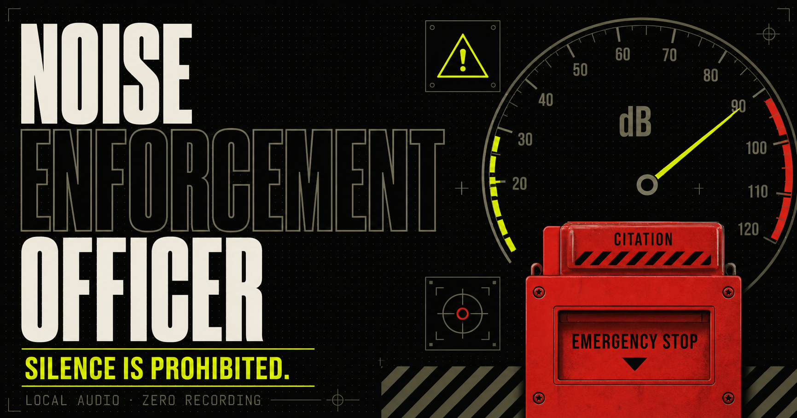

# Noise Enforcement Officer

> An absurd automated officer that detects unacceptable silence and files the complaint as noise.

## Team

- Jan Pfrenger — builder / public nuisance administrator

## What is this?

A mobile-first browser app that continuously measures the room’s relative
volume locally. If the environment remains below an adjustable threshold for
an adjustable grace period, it deploys a tightly cut burst of original
synthesized sirens, buzzers, chirps, and a voice citation. It cools down, checks
again, and repeats while the world remains offensively peaceful.

**Live demo:** https://janpfrenger.github.io/SLOPATHON/projects/silence-enforcer/

## Why should this not exist?

- solves a problem nobody has
- wildly over-engineered for the outcome
- morally questionable UX (but designed with an emergency stop)

## What it does

**Actually does:**

- analyses microphone levels locally with Web Audio; nothing is recorded or uploaded
- exposes adjustable dBFS threshold, grace period, cooldown, and capped output gain
- cycles through ARMED, BLARING, and COOLDOWN states
- synthesizes copyright-safe alarm layers and rapid-cuts optional local files
- provides keyboard test mode when microphone access is unavailable
- automatically disarms when the page is hidden or the screen locks

**Should do (but doesn’t yet):**

- issue enforceable municipal citations
- detect whether your neighbours deserve this

## How it works

```text
local microphone level
  -> unacceptable silence timer
  -> tightly cut synthesized bureaucracy
  -> cooldown
  -> repeat offence inspection
```

No `MediaRecorder`, server API, analytics, or audio upload path exists.

## Run it

### Requirements

#### Software

- OS: any current desktop or mobile OS
- Browser: current Chrome, Safari, Firefox, or Edge
- Runtime for development: Node.js 22+
- Package manager: npm
- Accounts / API keys: none

#### Hardware

- a phone or computer with a microphone and speakers
- **do not use headphones**

### Setup

```bash
npm install
```

### Start

```bash
npm run dev
```

Keyboard-only testing is available from the input selector.

## Safety

Output defaults to 18%, is hard-capped at 55%, respects device mute/volume, and
passes through a limiter. A persistent DISARM / STOP control is visible during
every active state. Never use the app with headphones.

## Demo


